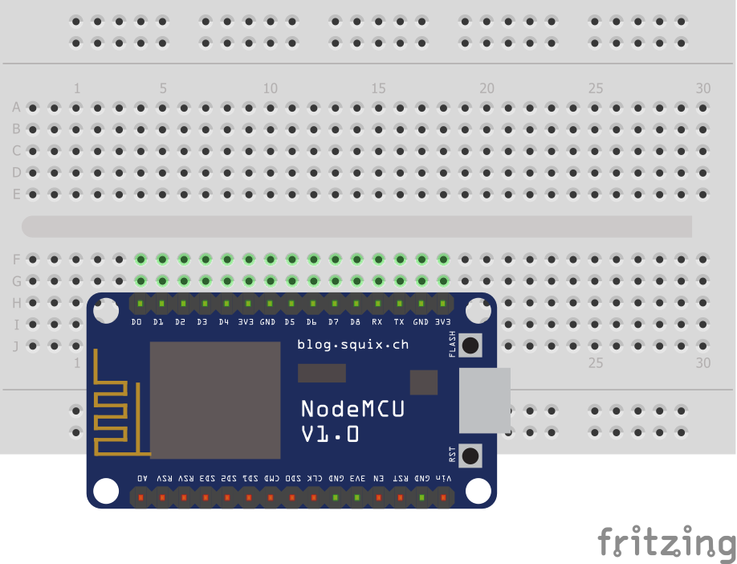
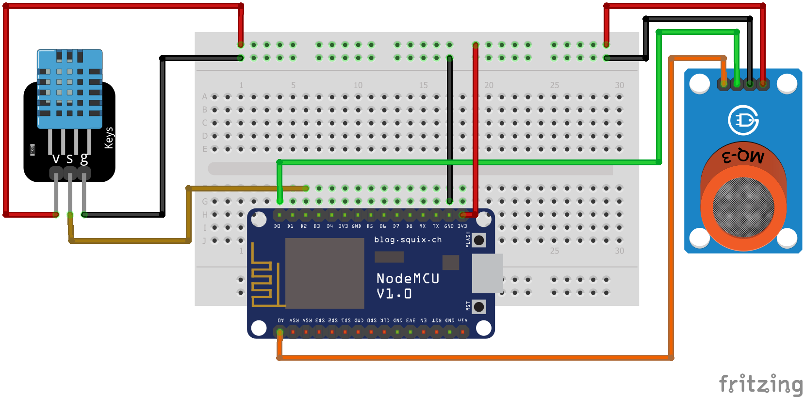
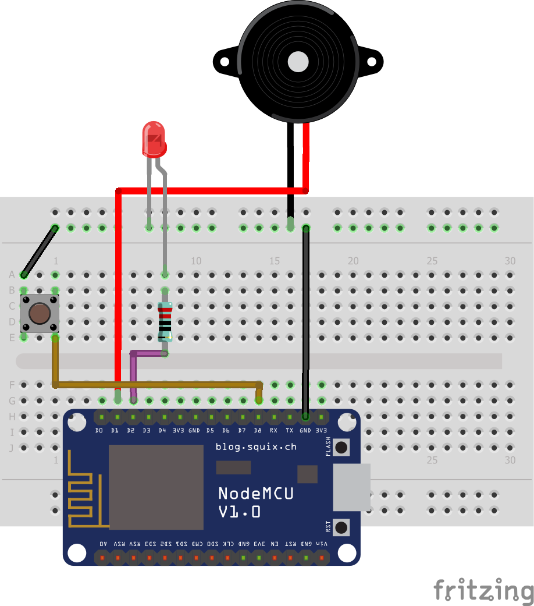

# proyek-akhir-internet-of-things
#### Kelas IoT C 2020, Informatika, Universitas Mulawarman

##### Kelompok 8:
- 2009106106 Yoga Tri Saputra
- 2009106119 Gilang Yuda Pratama
- 2009106146 Tjeng, Ivan Cahyadi

## **Sistem Pendeteksi Kebakaran dan Kebocoran Gas**

Sistem yang mampu mendeteksi kebakaran dan kebocoran gas. Sistem ini memiliki alarm yang akan aktif jika alarm dinyalakan secara paksa atau data telah melewati batas yang telah ditentukan. Sistem ini diakses melalui platform Blynk.

### Pembagian Tugas:
- Yoga Tri Saputra, Platform IoT
- Gilang Yuda Pratama, Perakitan dan Protokol MQTT
- Tjeng, Ivan Cahyadi, Coding

### Komponen yang Digunakan:
- Master Node:
    1. ESP8266 x1
    2. Breadboard x1
- Sensor Node:
    1. ESP8266 x1
    2. Breadboard x1
    3. DHT11 x1
    4. MQ-2 x1
    5. Jumper Cable Male to Male
    6. Jumper Cable Male to Female
- Alarm Node:
    1. ESP8266 x1
    2. Breadboard x1
    3. LED x1
    4. Buzzer x1
    5. Resistor x1
    6. Jumper Cable Male to Male

### Board Schematics:
- 
- 
- 